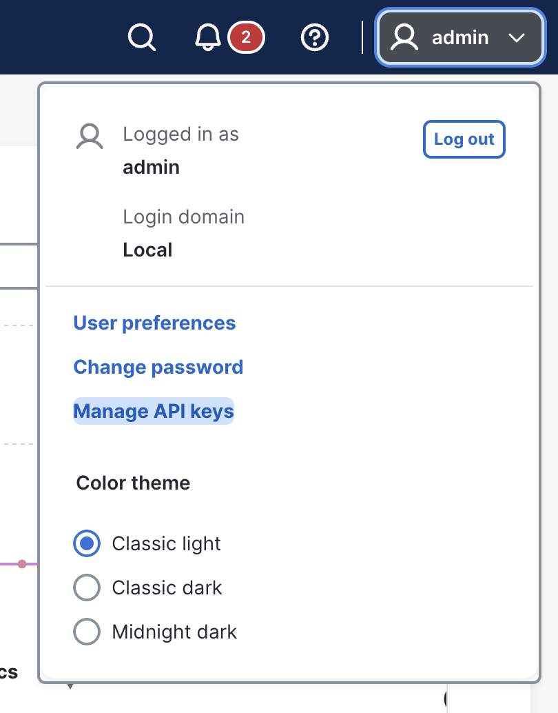
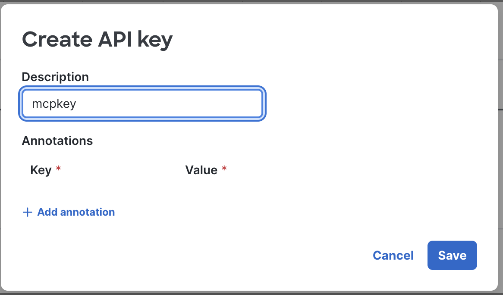
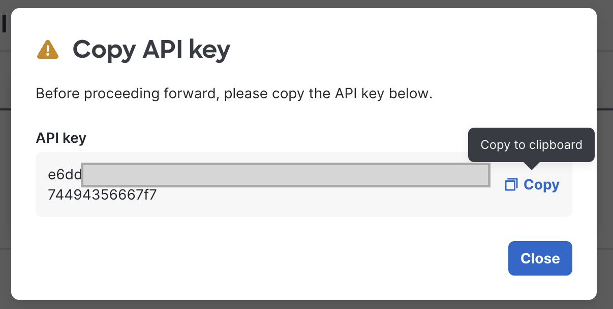
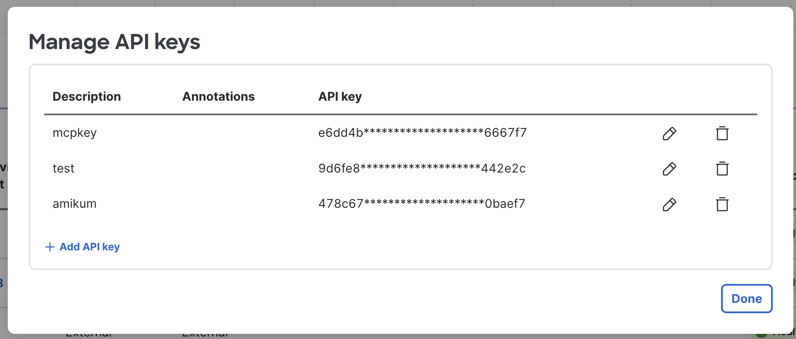

# Connecting OpenAI Codex to the Cisco Nexus Dashboard (ND 4.3+) Built-in MCP Server

Step-by-step guide to connect the **OpenAI Codex CLI** to the **read-only MCP server that ships natively with Nexus Dashboard 4.2**, so an LLM agent can query fabric health, anomalies, topology, and AI/ML job telemetry conversationally.


---

## Contents

1. [Prerequisites](#1-prerequisites)
2. [Generate an ND API Key](#2-generate-an-nd-api-key)
3. [Trust the ND Self-Signed Certificate](#3-trust-the-nd-self-signed-certificate)
4. [Configure Codex](#4-configure-codex)
5. [Restart and Verify](#5-restart-and-verify)
6. [Tools Exposed by the ND MCP Server](#6-tools-exposed-by-the-nd-mcp-server)
7. [Example Prompts](#7-example-prompts)
8. [Troubleshooting](#8-troubleshooting)

---

## 1. Prerequisites

- Nexus Dashboard **4.3**  reachable over HTTPS from your workstation
- Fabrics onboarded on ND
- OpenAI Codex  installed
- `curl` and `openssl` available (used to verify connectivity and certificates at each step)

---

## 2. Generate an ND API Key

The ND MCP server authenticates with **static headers **: `X-Nd-Apikey` + `X-Nd-Username`. There is **no Bearer token and no `Authorization` header**  in this flow.

1. Log in to the ND web UI as your admin user.
2. Click the **user dropdown** in the top-right corner of the header (shows your username, e.g. `admin`). In the dropdown — below *User preferences* and *Change password* — click **Manage API keys**.
 
   

3. The **Manage API keys** dialog opens, listing any existing keys (description, annotations, masked key value). Click **+ Add API key** at the bottom of the list.
4. In the **Create API key** dialog, enter an optional **Description** (e.g. `codex-mcp`). Annotations are optional. Click **Save**.
 
   
 

6. A **Copy API key** dialog appears with the full key value and a note that this is the only time it is shown. Click **Copy** (a *Copy to clipboard* tooltip confirms), then **Close**.
   > ⚠️ The key value cannot be retrieved again — only its masked form appears in the list afterwards. If you lose it, delete the key and create a new one.

   
   
7. Back in **Manage API keys**, the new key now appears in the list with a masked value. Click **Done**.

   

The copied key goes into `config.toml` in step 4.

---

## 3. Trust the ND Self-Signed Certificate

ND generates a fresh self-signed certificate on **every install**. Codex is a compiled binary that uses the **operating system's trust store** — so the cert must be trusted at the OS level. `NODE_EXTRA_CA_CERTS` has no effect on Codex (that is a Node.js mechanism), and there is no `rejectUnauthorized: false` equivalent in Codex config.

### 3.1 Fetch the certificate chain (all platforms)

```bash
openssl s_client -showcerts -connect <your-ND-IP>:443
```

### 3.2 Identify the ROOT certificate

Find the cert where `s:` (subject) and `i:` (issuer) **match exactly**:

```
s:C=US, ST=CA, O=Cisco System, CN=WZP26190CV4
i:C=US, ST=CA, O=Cisco System, CN=WZP26190CV4   ← subject == issuer → this is the root
```


> ⚠️ Do **not** trust the leaf certificate (CN like `sn-apigw`). Trusting the leaf may appear to work in a browser but fails chain validation for native-TLS clients.

Copy the matching block — **including** the `-----BEGIN CERTIFICATE-----` and `-----END CERTIFICATE-----` lines — into a file named `cisco-ca.pem`.

### 3.3 Add it to the OS trust store

**macOS**

```bash
sudo security add-trusted-cert -d -r trustRoot \
  -k /Library/Keychains/System.keychain cisco-ca.pem
```

Enter your system password when prompted.

**Linux (Debian / Ubuntu)**

```bash
sudo cp cisco-ca.pem /usr/local/share/ca-certificates/cisco-ca.crt
sudo update-ca-certificates
```

**Linux (RHEL / Fedora / CentOS)**

```bash
sudo cp cisco-ca.pem /etc/pki/ca-trust/source/anchors/
sudo update-ca-trust
```

**Other operating systems:** add `cisco-ca.pem` as a trusted root CA in your OS's native certificate store using its standard mechanism — the requirement is always the same: the *root* cert, trusted *system-wide*.

### 3.4 Verify trust before touching Codex

```bash
curl -s -H "X-Nd-Apikey: <your-api-key>" \
     -H "X-Nd-Username: admin" \
     https://<your-ND-IP>/api/v1/mcp -o /dev/null -w "%{http_code}\n"
```

Any HTTP status code means TLS and reachability are fine. A TLS error means the wrong cert was trusted — fix this before configuring Codex.

> **Note:** if ND is reinstalled, certificates regenerate and this section must be repeated. Alternatively, upload org-trusted certificates into ND and skip cert-fetching entirely (the typical customer setup).

---

## 4. Configure Codex

Edit `~/.codex/config.toml` and add:

```toml
[mcp_servers.nd-mcp-server]
url = "https://<your-ND-IP>/api/v1/mcp"
http_headers = { "X-Nd-Apikey" = "<your-api-key>", "X-Nd-Username" = "admin" }
```

Few things to keep in mind:

1. **Do NOT add `bearer_token_env_var` — not even empty.** Its mere *presence* blocks MCP initialization: Codex sees the field and attempts a Bearer flow that ND does not support. Omit the line entirely.
2. **No `Authorization` header.** ND auth is static headers only; adding Bearer/Authorization does not fall back gracefully.
3. **Do not copy Cursor's `mcp.json` fields.** `type` and `rejectUnauthorized` have no Codex equivalents. Header names are case-sensitive.

---

## 5. Restart and Verify

**A reload is not enough.** Stale in-memory Codex sessions hold half-initialized MCP state after config changes — fully quit (Cmd+Q on macOS, kill every `codex` process on Linux) and reopen.

Then check the Codex MCP panel:

- Expected status: **`Auth unsupported / Enabled`**. This is **success**, not failure — it means Codex's OAuth/Bearer machinery isn't in use, which is exactly right for static-header auth.
- The 8 ND tools (below) should be listed.
- Smoke-test: `What are the fabrics on my ND?`

---

## 6. Tools Exposed by the ND MCP Server

All tools are **read-only**.

| # | Tool | Purpose | Key Parameters |
|---|---|---|---|
| 1 | `get_fabric_summary` | High-level fabric health; per-fabric adds switches, interface overview, endpoint summary | `fabricName` (opt), `max`, `anomalyLevel`, `interfaceType`, `adminStatus`, `operationalStatus`, `startDate`, `endDate`, `filter` |
| 2 | `get_fabric_details` | Full interface list (status, anomaly level, type) + endpoint list with filters | `fabricName` (req), `max`, `offset`, interface filters, `mac`, `ipCollection`, `nodeNames`, `sort` |
| 3 | `get_nd_anomalies_summary` | Anomalies + advisories: lists, severity/category summaries, grouping by mnemonic title. Defaults to last 2 hours | `fabricName` (req), `startDate`/`endDate`, `groupBy`, `fabricType` (default ACI — set explicitly for NX-OS!), `severity`, `category`, `anomalyName`, `mnemonicTitle` |
| 4 | `get_nd_anomaly_details` | Root-cause analysis for one anomaly: details + node graph | `fabricName` (req), `anomalyId` (req), `startDate` (req, from anomaly list) |
| 5 | `get_nd_ai_jobs` | All AI jobs in a date range: GPU allocation, runtime, state | `startDate`/`endDate`, `sort`, `max`, `stateCategory` |
| 6 | `get_nd_ai_job_details` | AI/ML resources: GPU details, job anomalies, interface stats, time-series metrics | `jobId` (req), `fabricName`, `gpuId`, `serverName`, `statisticsName` (`crc`, `drops`, `congestionScore`), `granularity` |
| 7 | `get_unified_topology` | Topology graph: nodes, edges, relationships (omit `fabricName` for all fabrics) | `fabricName` (opt) |
| 8 | `get_fabric_network_analytics` | Interface stats, congestion (PFC, drops), optional GPU utilization | `fabricName` (req), `gpuId` + `serverName` for GPU stats |

**Usage traps:**

- Tool 3 defaults `fabricType` to **ACI** — pass it explicitly for NDFC/NX-OS fabrics or expect empty/wrong results.
- Tool 4 requires the `startDate` from the anomaly *list* response — the agent must chain tool 3 → tool 4.

---

## 7. Example Prompts

```text
What are the fabrics on my ND?
What are the details of the switches on my ND server?
Get me the anomalies for my fabrics on ND.
Categorize the anomalies on my ND by title and share with me. Why do these anomalies occur?
What AI/ML training jobs are currently running? Show GPU allocation, runtime, and job states.
What interfaces in fabric <fabricName> are currently down or have anomalies?
What is the network utilization for fabric <fabricName>? Show PFC statistics, drops, congestion metrics.
Give me a summary of advisories for fabric <fabricName> grouped by severity for <startDate> to <endDate>.
Compare the anomalies and advisories for <fabric1> and <fabric2> on ND.
```

---

## 8. Troubleshooting

Work through these in order — each maps back to a step above:

| Symptom | Likely cause | Fix |
|---|---|---|
| MCP server never initializes | `bearer_token_env_var` present in the config block | Delete the line entirely (§4, rule 1) |
| TLS / certificate errors | Leaf cert trusted instead of root, or fresh ND install regenerated certs | Re-do §3; root = subject == issuer |
| Tools missing after a config edit | Stale in-memory session | Full quit + reopen (§5) |
| Auth or OAuth error reported | TLS trust or header issue upstream of auth | Run the `curl` check (§3.4) to isolate whether the problem is TLS, reachability, or the API key |
| "Auth unsupported / Enabled" in MCP panel | Nothing — this is the healthy state | Stop debugging |
| Tool 3 returns nothing for your fabric | `fabricType` defaulted to ACI | Ask the agent to pass `fabricType` for NX-OS |

Also in this repo: [`examples/config.toml.example`](examples/config.toml.example) and [`examples/verify.sh`](examples/verify.sh) (runs the §3.4 checks in one command).

---

## Security Notes

- The built-in ND MCP server is **read-only** — no write/deploy tools are exposed.
- API keys carry your ND user's privileges. `config.toml` lives in `~/.codex/`, outside version control; the `.gitignore` here also blocks `*.pem` and `config.toml` as a safety net.

---

## References

- [Model Context Protocol](https://modelcontextprotocol.io/)
